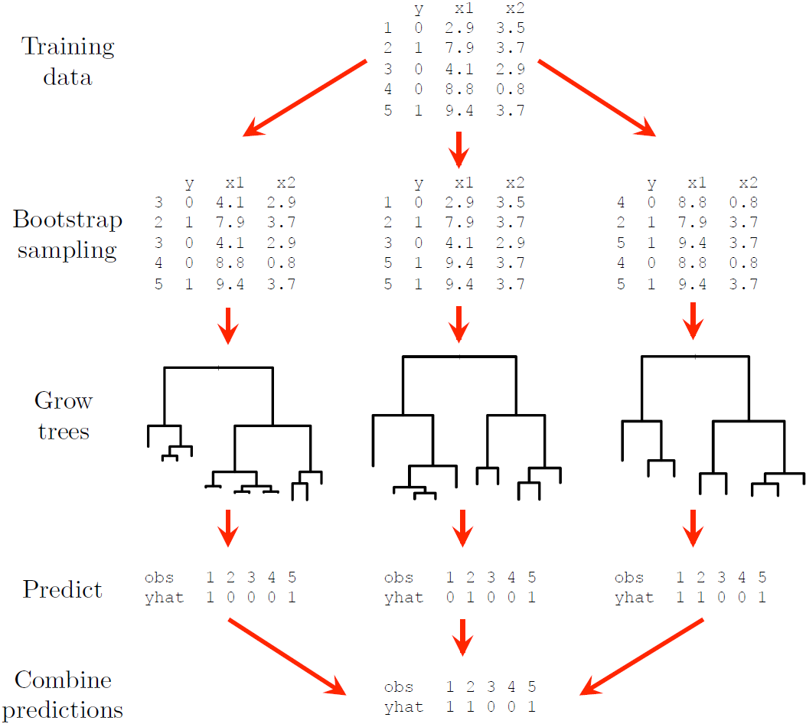

# Tree-based Methods

```{r, setup6, include=F}
rm(list =ls())
library(knitr)
library(benchmarkme)
knitr::opts_chunk$set(
  warnings = F,
  message = F,
  fig.path = 'figs/'
)
```

The final topic in this section of the course is tree-based methods, i.e. decision trees[^06-tbm-1] and their extensions. We will cover classification and regression trees, random forests, and gradient boosted trees. Although chapter 8 of @james2013introduction contains a concise summary of these methods, the interested reader is rather referred to section 9.2 of @hastie2009elements for trees and chapter 15 for random forests, and section 16.4 of @murphy for boosting.

[^06-tbm-1]: Not be confused with decision trees as used in the decision theory context.

Classification and regression trees -- often abbreviated as CART or just referred to as decision trees collectively -- are simple, non-parametric classification/regression methods that utilise a tree structure to model the relationships among the features and the potential outcomes. Although decision trees are conceptually very simple, they can be quite powerful, especially when ensembled. They are built using a heuristic called recursive binary partitioning (divide and conquer) that partitions the feature space into a set of (hyper) rectangles. The prediction following the partitioning depends on whether the response is quantitative on qualitative, hence we will again consider regression and classification problems separately, starting with the former.

## Regression trees

Let $Y$ denote a continuous outcome variable and let $X_1, X_2, \ldots, X_p$ be a set of predictors/features, of which we have $n$ observations. The regression tree algorithm entails repeatedly splitting the p-dimensional feature space into distinct, non-overlapping regions, with the splits orthogonal to the axes.

Suppose that we partition the feature space into $M$ regions, $R_1 , R_2, \ldots, R_M$. Then for each region, we model the response as a **constant**, $c_m$:

```{=tex}
\begin{equation}
f(\boldsymbol{x}) = \sum_{m=1}^Mc_mI(\boldsymbol{x} \in R_m).
(\#eq:cart-f)
\end{equation}
```
As with other regression models, our goal is still to minimise

```{=tex}
\begin{equation}
RSS = \sum_{m=1}^{M}\sum_{i:x_i\in R_m}\left[y_i - \hat{f}(\boldsymbol{x} _i)\right]^2.
(\#eq:rss-tree)
\end{equation}
```
Therefore, the best $\hat{c}_m$ to minimise this criterion is simply the average of the $y_i$ in each region $R_j$:

```{=tex}
\begin{equation}
\hat{c}_m = \text{ave}(y_i|\boldsymbol{x}_i \in R_m)
(\#eq:cm-hat)
\end{equation}
```
Exhaustively searching over every possible combination of regions is computationally infeasible. Therefore, we use a top-down, greedy algorithm called **recursive binary splitting**:

1.  First, select the predictor $X_j$ and split point $s$ such that the regions $R_1(j, s) = \{X|X_j < s\}$ and $R_2(j, s) = \{X|X_j \geq s\}$ lead to the greatest possible **reduction in RSS**. That is, we consider all predictors $X_1, \ldots, X_p$, and all possible values of the split point $s$ for each of the predictors, and then choose the predictor and split point such that Equation \@ref(eq:rss-tree) is minimised.

2.  Next, identify the predictor and split point that best splits one of the previously identified regions, such that there are now three regions.

3.  Continue splitting the regions until a **stopping criterion** is reached. For instance, we may continue until no region contains more than 5 observations, or when the proportional reduction in $RSS$ is less than some threshold.

Once the regions $R_1 , R_2, \ldots, R_M$ have been created, we predict the response for a given test observation using the mean of the training observations in the region to which that test observation belongs.

As a brief side note, the model from Equation \@ref(eq:cart-f) can also be written in the form

$$f(\boldsymbol{x}) = \sum_{m=1}^Mc_mI(\boldsymbol{x} \in R_m) = \sum_{m=1}^Mc_m \phi(\boldsymbol{x}; \boldsymbol{v}_m),$$ where $\boldsymbol{v}_m$ encodes the choice of variable to split on $(X_j)$ and the split point value $(s)$ on the path from the start (root) to the $m$^th^ region (leaf). When viewed as such, a CART model is just an adaptive basis function model (alluded to in the previous chapter), where the basis functions define the regions, and the weights specify the response value in each region [@murphy, p. 544].

One of the advantages of a decision tree is its visual representation which makes for easy interpretation. This is best illustrating via an example.

### Example 6 -- California housing

In this example we consider a well-known dataset from the 1990 California census, which contains aggregated data for 20 640 neighbourhoods. The variables include information like the neighbourhood's median house age, the median income, total number of bedrooms and bathrooms, number of households, population, and the **location**, as can be seen here:

```{r, warning=F}
library(DT)
calif <- read.csv('data/calif.csv')
datatable(calif, options = list(scrollX = T, pageLength = 6))
```

\  

For now, we will only use the spatial information (latitude and longitude) to model the target variable: (log of) **median house price**.

We begin by plotting a map of the data -- a 2-dimensional feature space -- using a colour scale to indicate the target variable.

```{r calif-map, warning=F, fig.align='center', fig.dim=c(6,6), fig.cap='Californian median neighbourhood house prices (logscale) in 1990.'}
library(maps) 
library(RColorBrewer) # For colourblind friendly palettes

# Replace with log
calif$HousePrice <- log(calif$HousePrice)

# Make custom colour scale
n_breaks <- 9
my_cols <- brewer.pal(n_breaks, 'YlOrBr')[cut(calif$HousePrice, breaks = n_breaks)]

# Plot the data
plot(calif$Longitude, calif$Latitude, pch = 16, cex = 0.5, bty = 'L', 
     xlab = 'Longitude', ylab = 'Latitude', col = my_cols)
legend(x = 'topright', bty = 'n', title = 'Log Median House Price', cex = 0.9,
       legend = round(seq(min(calif$HousePrice), max(calif$HousePrice), length.out = n_breaks), 2),
       fill = brewer.pal(n_breaks, 'YlOrBr'))

# Add the state border
map('state', 'california', add = T, lwd = 2)
text(-123, 35, "Pacific Ocean")
```

We can now proceed to partition the feature space using recursive binary splitting, resulting in a regression tree. There are many packages in R that implement decision trees. We will be using one of the more basic ones: `tree`. For now we are not going to split into training and testing; for illustrative purposes we shall use the entire dataset.

Using the default stopping criteria, we fit the following decision tree shown below in Figure \@ref(fig:calif-tree)

```{r calif-tree, warning=F, fig.align='center', fig.dim=c(12, 9), fig.cap='Vanilla regression tree fitted to the Cailfornia dataset'}
library(tree)
#Easy as one two tree
calif_tree <- tree(HousePrice ~ Latitude + Longitude, data = calif)

# Plot the tree
plot(calif_tree)
text(calif_tree)
```

The corresponding feature space is shown below in Figure \@ref(fig:calif-fs).

```{r calif-fs, fig.align='center', fig.dim=c(6, 6), fig.cap='Partitioned feature space for vanilla regression tree fitted to the Cailfornia dataset'}
# Plot the data again
plot(calif$Longitude, calif$Latitude, pch = 16, cex = 0.5,
     col = my_cols, xlab = 'Longitude', ylab = 'Latitude', bty = 'o')

# And add the partitioned feature space
partition.tree(calif_tree, ordvars = c('Longitude', 'Latitude'), add = T, lwd = 3)
```

The labels in Figure \@ref(fig:calif-tree) indicate both the splitting variable and the split point. All data points below the split point for that variable go to the left of that branch or, equivalently, are left/below the resulting line in the partitioned feature space.

The final regions correspond to the ends of the tree's branches, which are indeed referred to as **leaves**, or **terminal nodes**. The leaf values are the fitted values for all the data points in that region, which is just the average (Equation \@ref(eq:cm-hat)).

It is easy to see visually that the algorithm attempts to group together pockets of most-similar observations. Again, though, the question arises of when to stop? This returns us to the same consideration we encountered in all previous models, namely that of model complexity.

### Cost complexity pruning

A decision tree's complexity is measured by the number of leaves (which is equal to the number of splits + 1). We could continue splitting until every single observation is in its own region, such that the training $RSS = 0$ (each $y_i$ will be equal to its region's average). However, this would be extreme overfitting, and the model would perform very poorly on unseen data. As with all statistical learning algorithms, we need to determine the ideal level of complexity that captures as much information as possible without overfitting.

One way of controlling complexity is to continue growing the tree only until the decrease in RSS fails to exceed some high threshold. However, this is short-sighted since a split later on might produce an even greater reduction in RSS. A better strategy is therefore to grow a very large tree and then **prune** it back to obtain a smaller **subtree**.

Since our goal is to find the subtree with the lowest test error, we can estimate any given subtree's test error using cross-validation. However, estimating the CV error for every possible subtree is not computationally feasible. Instead we only consider a sequence of trees obtained by pruning the full tree back in a nested manner. This tree pruning technique is known as **cost complexity pruning**, or weakest link pruning, and is essentially a form of regularisation.

Let $T_0$ be the full tree and let $T\subseteq T_0$ be a subtree with $|T|$ terminal nodes or, equivalently, regions in the feature space. We now penalise the RSS according to $|T|$:

```{=tex}
\begin{equation}
RSS_{\alpha} = \sum_{m=1}^{|T|}\sum_{i:x_i\in R_m}\left[y_i - \hat{f}(\boldsymbol{x} _i)\right]^2 + \alpha|T|,
(\#eq:rss-pen)
\end{equation}
```
where $\alpha \ge 0$ is a tuning parameter.

When $\alpha = 0$, $RSS_{\alpha} = RSS$ and therefore $T=T_0$. For values of $\alpha > 0$, we seek the subtree $T$ that minimises $RSS_{\alpha}$. As $\alpha$ increases, subtrees with a large number of leaves are penalised more heavily and a smaller $T$ will be favoured such that branches are "pruned" off. This happens in a nested fastion, such that we can easily obtain subtrees as a function of $\alpha$.

By choosing $\alpha$, we are effectively selecting a subtree; that is, a more parsimonious model that does not overfit the sample data. We want the subtree (and hence $\alpha$ value) that has the lowest test error and therefore has the best predictive performance on unseen data. Therefore, we will once again use CV to determine this $\alpha$/subtree.

To illustrate this, we return to the California dataset, this time using all the predictors.

```{r}
# First fit larger tree by relaxing stopping criteria

# ?tree.control
# minsize: will only consider split if at least so many observations in node
# mincut: will only split if both child nodes then have at least so many
# mindev: will only consider split if within-node deviance is at least this times root RSS

stopcrit <- tree.control(nobs = nrow(calif), mindev = 0.003)
calif_bigtree <- tree(HousePrice ~ . , data = calif, control = stopcrit)
(s <- summary(calif_bigtree))
```

By slightly relaxing the stopping criterion of RSS reduction, we increased the size of the tree to `r s$size`. We also see that the only features used to split were income, house age, and latitude and longitude, so the location information was indeed very useful!

Plotting the tree at this size is already quite messy (Figure \@ref(fig:calif-big-tree)), with a lot of unnecessary, indistinguishable information at the bottom.

```{r calif-big-tree, fig.align='center', fig.dim=c(12, 18), fig.cap='Large regression tree fitted to the Cailfornia dataset'}
plot(calif_bigtree)
text(calif_bigtree)
```

We now apply cost complexity pruning, measuring the CV RSS for each subtree.

```{r calif-cv, fig.align='center', fig.cap='Cross-validated pruning results on the large tree fitted to the Cailfornia dataset'}
set.seed(4026)
calif_cv <- cv.tree(calif_bigtree)

# See str(calif_cv)
# size = number of terminal nodes
# dev = RSS
# k = alpha (tuning parameter that determines tree size)
calif_cv$k[1] <- 0 #First entry was -Inf

# Plot everything
plot(calif_cv$size, calif_cv$dev, type = 'o', 
     pch = 16, col = 'navy', lwd = 2, 
     xlab = 'Number of terminal nodes', ylab = 'CV RSS')
axis(side = 1, at = 1:max(calif_cv$size), labels = 1:max(calif_cv$size))

# Add alpha values to the plot:
alpha <- round(calif_cv$k)
axis(3, at = calif_cv$size, lab = alpha)
mtext(expression(alpha), 3, line = 2.5, cex = 1.5)

# Highlight the minimum CV Error
T <- calif_cv$size[which.min(calif_cv$dev)] 
abline(v = T, lty = 2, lwd = 2, col = 'red')
```

We can see that the CV error did indeed keep decreasing. To check this, we show that the minimum RSS is indeed observed at 25 terminal nodes:

```{r}
calif_cv$size[which.min(calif_cv$dev)]
```

However, the improvement in results is negligible from about 15. One could certainly also argue that a tree of size 5 might be preferable, given that it performs comparably to a tree of size 10, and the improvement from that point on is not drastic. In fact, decision trees will rarely be used for prediction purposes, since they will most often be outperformed by other algorithms. Their main value arguably lies in their interpretability, hence we will consider opting for the simpler model.

```{r calif-pruned5, fig.align='center', fig.cap='Cailfornia housing regression tree pruned to 5 terminal nodes'}
# Prune the tree
calif_pruned5 <- prune.tree(calif_bigtree, best = 5)
plot(calif_pruned5)
text(calif_pruned5)
```

We see that this tree only uses `income` and `latitude` as splitting variables, perhaps suggesting that it is too simplistic, especially when compared to the 15-node tree. In Figure \@ref(fig:calif-pruned15) we see that although the gain in RSS reduction is comparatively limited, the later splits make extensive use of the location information. However, for neighbourhoods with a median income above 3.547, only `income` and `house age` were used in subsequent splits, indicating less interaction between income and location in the wealthy areas.

```{r calif-pruned15, fig.align='center', fig.dim=c(12, 15), fig.cap='Cailfornia housing regression tree pruned to 15 terminal nodes'}
# Prune the tree
calif_pruned15 <- prune.tree(calif_bigtree, best = 15)
plot(calif_pruned15)
text(calif_pruned15)
```

This example primarily serves to illustrate the interpretive properties of decision trees. We will explore their sensitivity to sampling variation and their performance on unseen data later once ensembling methods are introduced. First, however, we will see how this method can be used to classify a qualitative predictor.

## Classification trees

Consider now a categorical response variable $Y \in \{1, 2, \ldots, K\}$. Just like with regression trees, classification trees split the feature space into $M$ regions which correspond to the terminal (leaf) nodes of the tree. In lieu of an average to calculate for the observations falling within each region, the predicted value of an observation with $X \in R_m$ will now be the most commonly occurring class in $R_m$.

The **class proportions** in each terminal node provide an indication of the reliability of the prediction:

```{=tex}
\begin{equation}
\hat{p}_{mk} = \frac{1}{N_m} \sum_{i:x_i\in R_m} I(y_i = k),
(\#eq:class-p)
\end{equation}
```
where $N_m$ denotes the number of observations in region $R_m$.

Although classification trees are also grown by recursive binary splitting, RSS cannot be used as splitting criterion. Now, we could grow the tree by choosing the split that minimises the classification error at each step, i.e. minimise the proportion of incorrectly predicted observations. In practice, however, splitting on the reduction in classification error does not produce good trees. We will instead consider the following three splitting criteria, all of which are designed to measure **node impurity**.

### Splitting criteria

We would like the leaf nodes to be as homogeneous or "pure" as possible, with each leaf node ideally containing observations of only one response category. When deciding where to split on a particular dimension, we can use the following measurements to measure the resulting homogeneity.

**1. Gini Index**

Arguably the simplest way of measuring node impurity is via the Gini index (also referred to as Gini impurity or Gini's diversity index), which is defined as follows:

```{=tex}
\begin{equation}
G = \sum_{m=1}^{M}\sum_{k=1}^{K} \hat{p}_{mk} (1-\hat{p}_{mk}),
(\#eq:gini)
\end{equation}
```
where $\hat{p}_{mk}$ is the proportion of observations in response category $k = 1, \ldots, K$ within leaf node $m = 1, \ldots, M$. At each step during tree growth, we would therefore choose the split that produces the greatest reduction in the Gini index.

For a binary response, for example, $G_m = 2\hat{p}_m(1 - \hat{p}_m)$. Note that the Gini index is minimised when leaf node $m$ is homogeneous, i.e. when $\hat{p}_m = 0$ or $\hat{p}_m = 1$.

**2. Shannon entropy**

An alternative way to determine node impurity is to calculate the Shannon entropy of each terminal node, and again sum across all $M$ leaves:

```{=tex}
\begin{equation}
H = -\sum_{m=1}^{M}\sum_{k=1}^{K}\hat{p}_{mk}\log(\hat{p}_{mk}).
(\#eq:entropy)
\end{equation}
```
This measure, usually just referred to as **entropy**, stems from information theory and is equivalent to measuring information gain. Note that $\log_2$ is also often used in the definition, depending on the context. This yields units of "bits", whereas the natural logarithm in Equation \@ref(eq:entropy) yields "nats".

Considering again the binary case, Figure \@ref(fig:gini-ent) shows the similarity between the Gini index and entropy, with the misclassification rate included for reference. Note that the entropy has been scaled to go through the point $(0.5, 0.5)$.

```{r gini-ent, fig.align='center', fig.dim=c(6,6), fig.cap='Gini index, (scaled) entropy, and classification error as a function of node impurity for a binary response.'}
p <- seq(0, 1, 0.001)
Gini <- 2*p*(1-p)
Entropy <- -p*log(p) - (1-p)*log(1-p)
Entropy <- Entropy/max(na.omit(Entropy))*0.5
Misclass <- 0.5 - abs(p - 0.5)

plot(p, Entropy, 'l', lwd = 2, col = 'orange', ylab = '')
lines(p, Gini, 'l', lwd = 2, col = 'lightblue')
lines(p, Misclass, 'l', lwd = 2, col = 'darkgreen')
legend('bottom', c('Entropy', 'Gini Index', 'Misclassification rate'),
       col = c('orange', 'lightblue', 'darkgreen'), lty = 1, lwd = 2)
```

As seen in Figure \@ref(fig:gini-ent), the Gini index and entropy are computationally similar. In fact, the `tree` package in R uses Gini as a possible criterion, but not entropy.

There are several sources on the topic that use ambiguous and, at times, contradictory terminology to refer to Shannon entropy. For example, page 309 of @hastie2009elements refers to the measurement in Equation \@ref(eq:entropy) as "cross-entropy" or "deviance", whilst @murphy uses the term "entropy", but also equates it to deviance on page 547.

However, on page 221 of @hastie2009elements we see that the term **deviance** is also used to refer to the quantity $2 \times \text{NLL}$ (negative log-likelihood). In fact, it is the NLL that is known as **cross-entropy** [@bishop, p. 209]. Cross-entropy[^06-tbm-2] is usually used as a measure of dissimilarity between two probability distributions, typically the predicted class probabilities and the true class probabilities, in which case this loss function is also referred to as "log loss".

[^06-tbm-2]: The cross-entropy between two distributions, $P$ and $Q$, is equal to the entropy of $P$ plus the Kullback-Leibler (KL) divergence from $P$ to $Q$.

Deviance, which is proportional to NLL, therefore offers a likelihood-based approach to measuring node impurity.

**3. Deviance**

The deviance is constructed by viewing a classification tree as a probability model. Let $\boldsymbol{Y}_m$, denoting the set of categorical responses in leaf node $m$, be a random sample of size $n_m$ from the multinomial distribution:

```{=tex}
\begin{equation}
p(\boldsymbol{y}_m) = \binom{n_m}{n_{m1} \cdots n_{mK} } \prod_{k=1}^{K} p_{mk}^{n_{mk}}.
(\#eq:dev-multin)
\end{equation}
```
The likelihood over all $M$ leaf nodes is then given by

```{=tex}
\begin{equation}
L = \prod_{m=1}^{M} p(\boldsymbol{y}_m) \propto \prod_{m=1}^{M} \prod_{k=1}^{K} p_{mk}^{n_{mk}}.
(\#eq:dev-L)
\end{equation}
```
Now, the **deviance** is defined as

```{=tex}
\begin{equation}
D = -2\log(L) = -2 \sum_{m=1}^{M} \sum_{k=1}^{K} n_{mk} \log(p_{mk}).
(\#eq:dev)
\end{equation}
```
We want the model that makes the data most probable, i.e. has the highest likelihood. This is equivalent to **minimising the deviance**. When we grow a classification tree, we therefore choose the split that reduces the deviance by the most at each step. Note that the deviance takes the number of observations in each terminal node into account, unlike the Gini index and entropy.

### Link between deviance and RSS

Returning to regression trees for a moment, if we inspect the object created by the `tree()` function for the California housing data, we note that the RSS is actually referred to as "deviance" in the model output.

```{r}
# Model summary
(calif_s <- summary(calif_tree))

# RSS (dev)
calif_s$dev
```

To make the link between the deviance of a classification tree and the RSS of a regression tree, suppose that for terminal node $m$ the continuous response $\boldsymbol{Y}_m$ is a random sample of size $n_m$ from $N(\mu_m, \sigma^2)$, such that the joint distribution of $\boldsymbol{Y}_m$ is

```{=tex}
\begin{equation}
f(\boldsymbol{y}_m) = \left(\frac{1}{\sigma \sqrt{2\pi}} \right)^{n_m} \exp \left(\frac{-\sum_{i:x_i\in R_m} (y_i - \mu_m)^2}{2\sigma^2} \right).
(\#eq:py)
\end{equation}
```
Since we are effectively modelling the $\mu_m$, the likelihood of the means over all $M$ leaf nodes is given by

```{=tex}
\begin{equation}
L(\boldsymbol{\mu}|\boldsymbol{x}) = \prod_{m=1}^{M} f(\boldsymbol{y}_m) \propto \exp \left(-\frac{1}{2}\sum_{m=1}^{M}\sum_{i:x_i\in R_m} (y_i - \mu_m)^2 \right),
(\#eq:L-tree)
\end{equation}
```
such that the deviance can be expressed as

```{=tex}
\begin{equation}
D = -2\log(L) \propto \sum_{m=1}^{M}\sum_{i:x_i\in R_m} (y_i - \mu_m)^2 = RSS.
(\#eq:dev-reg)
\end{equation}
```
Since the deviance is directly proportional to the RSS in this setting, minimising the one is equivalent to minimising the other.

Let us turn our attention back to classification trees and consider managing their complexity.

### Cost complexity pruning

Just like with regression trees, we must prune a fully grown classification tree to avoid overfitting. However, as with the splitting rules, we cannot use the $RSS_{\alpha}$ criterion for pruning when the response is categorical. Similar to regression trees though, we will again minimise a specified cost complexity criterion, penalised according to the size of the tree, $|T|$:

```{=tex}
\begin{equation}
C_{\alpha}(T) = C(T) + \alpha|T|,
(\#eq:class-pen)
\end{equation}
```
where $C(T)$ represents a chosen cost function. Although we could use any of the aforementioned criteria, if prediction accuracy of the final pruned tree is the goal, then $C(T)$ should be taken as the **misclassification rate** of tree $T$.

The following section illustrates the application to a binary classification problem.

### Example 7 -- Titanic

The famous Titanic dataset contains information on 891 passengers that were aboard the Titanic on its one and only journey. The goal is to predict survival (yes/no) based on the predictors shown in the following table:

```{r, warning=F}
titanic <- read.csv('data/titanic.csv', stringsAsFactors = T)
titanic$Pclass <- as.factor(titanic$Pclass) #Class coded as integer, should be factor

datatable(titanic, options = list(scrollX = T, pageLength = 6))
```

\  

Most of the features are self-explanatory. `SibSp` refers to the passenger's number of siblings plus spouses on board; `Parch` to their number of parents and children; and `Embarked` to their port of embarkation[^06-tbm-3].

[^06-tbm-3]: The Titanic initially departed from Southampton (S), then picked up passengers at Cherbourg, France (C), before making a final stop at Queenstown, Ireland (Q), today known as Cobh.

To start with, we will first fit a classification tree using Gini index as splitting criterion.

```{r titanic-gini, fig.align='center', fig.dim=c(12, 15), fig.cap='Classification tree fitted to the Titanic dataset using Gini index as splitting criterion'}
titanic_tree_gini <- tree(Survived ~ ., data = titanic, split = 'gini')
plot(titanic_tree_gini)
text(titanic_tree_gini, pretty = 0)
```

This yields a rather large tree, where the most useful feature (sex) is only used after a few prior splits. Compare this to the tree resulting from using deviance as splitting criterion (the default in the `tree` package), shown in Figure \@ref(fig:titanic-dev).

```{r titanic-dev, fig.align='center', fig.cap='Classification tree fitted to the Titanic dataset using deviance as splitting criterion'}
titanic_tree <- tree(Survived ~ ., data = titanic)
plot(titanic_tree)
text(titanic_tree, pretty = 0)
```

This presents a similar picture to what one would expect given the emergency protocol of "women and children first", although age was only an important factor for 2^nd^ and 3^rd^ class male passengers. We can extract any information for any of the nodes from the fitted object, or add different labels to the terminal nodes (see `?text.tree`).

As a brief detour, let us show that the deviance measurement provided by the model's summary indeed matches the definition set out in Equation \@ref(eq:dev). We will use the `frame` object contained in the model object to calculate the total deviance of the tree shown in Figure \@ref(fig:titanic-dev).

```{r}
f <- titanic_tree$frame                      #We need the n's and the probs
n_m <- f$n[f$var == '<leaf>']                #This is total n per leaf, not per class!
p_n <- f$yprob[,1][f$var == '<leaf>']        #Pr(no) for all leaf nodes
p_y <- f$yprob[,2][f$var == '<leaf>']        #Pr(yes) for all leaf nodes
nlp <- (n_m*p_n)*log(p_n)+(n_m*p_y)*log(p_y) #\sum_k (n_k log(p_k)) for all leaves
nlp[is.nan(nlp)] <- 0                        #Need to deal with log(0)
(D <- -2*sum(nlp))                           #Deviance
```

Comparing this to the total deviance reported, we see that it indeed matches:

```{r}
titanic_s <- summary(titanic_tree)
titanic_s$dev
```

Note that although the deviance splitting criterion is used in software implementation as was shown here, none of the aforementioned sources explicitly define this criterion in the relevant sections on classification trees.

Another way of exploring the fitted tree -- more as an exploration tool as opposed to one for reporting -- is to simply print the object:

```{r}
titanic_tree
```

Here we can see the path containing male passengers of class 2 or 3, age $\leq$ 9, and siblings $\leq$ 2 had a total of 16 passengers...all of whom survived! The best way to gauge whether this is indeed a pattern in the data (as opposed to a seemingly significant pocket of random variation), is to use cross-validation to estimate out-of-sample performance for pruned trees of different sizes.

In the code below we see that one must specify the pruning cost complexity function, which we will set to the misclassification rate.

```{r titanic-cv, fig.align='center', fig.cap='Cross-validated pruning results on a classification tree fitted to the Titanic dataset'}
# First, grow a slightly larger tree
titanic_bigtree <- tree(Survived ~ ., data = titanic, 
                        control = tree.control(nobs = nrow(na.omit(titanic)), 
                                               mindev = 0.005))

# Then prune it down
set.seed(28)
titanic_cv <- cv.tree(titanic_bigtree, FUN = prune.misclass) #Use classification error rate for pruning

# Make the CV plot
plot(titanic_cv$size, titanic_cv$dev, type = 'o', 
     pch = 16, col = 'navy', lwd = 2,
     xlab = 'Number of terminal nodes', ylab='CV error')
titanic_cv$k[1] <- 0 #Don't want no -Inf
alpha <- round(titanic_cv$k,1)
axis(3, at = titanic_cv$size, lab = alpha, cex.axis = 0.8)
mtext(expression(alpha), 3, line = 2.5, cex = 1.2)
axis(side = 1, at = 1:max(titanic_cv$size))

T <- titanic_cv$size[which.min(titanic_cv$dev)] #The minimum CV Error
abline(v = T, lty = 2, lwd = 2, col = 'red')
```

For the specific seed set above, we see that a more parsimonious model with 4 leaves yields a lower CV error, which in Figure \@ref(fig:titanic-cv) is given as the number of misclassifications on the y-axis. Note that different seeds will yield different result. Next we prune the tree down to 4 leaves and plot the result.

```{r titanic-pruned, fig.align='center', fig.cap='Pruned classification tree fitted to the Titanic dataset'}
titanic_pruned <- prune.misclass(titanic_bigtree, best = T)
plot(titanic_pruned)
text(titanic_pruned, pretty = 0)
```

From the resulting tree, all males would be classified as not surviving, together with female passengers in class 3 who's fare was more than 20.8. We will once again not focus on prediction for single trees now, although we will include this as a benchmark when considering random forests and boosted trees.

In this example we saw that classification trees handle categorical predictors with ease, without the need to code dummy variables. Another benefit of this approach is that we can just as easily model target variables with multiple classes, as illustrated in the following example.

### Example 8 -- Iris

Another famous dataset, `Iris` contains data on 50 flowers from each of 3 species of iris. The measurements are on 4 features: sepal width, sepal length, petal width, and petal length. For the sake of illustrating the decision boundaries in two dimensions, we will only consider the sepal width and length. First, let's plot the data:

```{r iris, fig.align='center', fig.dim=c(6,6), fig.cap='Iris data plotted across sepal width and length.'}
# Load data
data('iris')

# Create index of species
ind <- as.numeric(iris$Species)

# Plot
plot(Sepal.Width ~ Sepal.Length, iris, xlab = 'Sepal Length', ylab = 'Sepal Width',
     col = c('red', 'green', 'blue')[ind],
     pch = c(1, 0, 5)[ind], lwd = 2, cex = 1.2)
legend(x = 'topright', legend = levels(iris$Species),
       pch = c(1, 0, 5), col = c('red', 'green', 'blue'), cex = 1.2)
```

Now let's fit a vanilla classification tree to the data and view the resulting partitioned feature space.

```{r iris-ct, fig.align='center', fig.dim=c(6,6), fig.cap='Partitioned feature space resulting from a vanilla classification tree fitted to the iris data.'}
# Vanilla tree
iris_tree <- tree(Species ~ Sepal.Width + Sepal.Length, iris)

# Grid for predicting
x <- seq(min(iris$Sepal.Length), max(iris$Sepal.Length), length.out = 65)
y <- seq(min(iris$Sepal.Width), max(iris$Sepal.Width), length.out = 65)
fgrid <- expand.grid(Sepal.Length = x, Sepal.Width = y)

# Predict over entire space
iris_pred <- predict(iris_tree, fgrid, type = 'class')

ind_pred <- as.numeric(iris_pred)

# Custom colours
r <- rgb(255, 0, 0, maxColorValue = 255, alpha = 255*0.25)
g <- rgb(0, 255, 0, maxColorValue = 255, alpha = 255*0.25)
b <- rgb(0, 0, 255, maxColorValue = 255, alpha = 255*0.25)

# Plot the predicted classes
plot(fgrid$Sepal.Width ~ fgrid$Sepal.Length,
     col = c(r, g, b)[ind_pred],
     pch = 15, xlab = 'Sepal Length', ylab = 'Sepal Width')

# And add the data
points(Sepal.Width ~ Sepal.Length, iris,
       col = c('red', 'green', 'blue')[ind],
       pch = c(1, 0, 5)[ind], lwd = 2, cex = 1.2)
legend(x = 'topright', legend = levels(iris$Species),
       pch = c(1, 0, 5), col = c('red', 'green', 'blue'), cex = 1.2)
```

Although these boundaries capture the underlying pattern seemingly well, we might well ask whether non-orthogonal boundaries would not have been more appropriate -- either linear or non-linear. This raises the question of which approach/model is "best".

The answer is that it depends on the problem. For some cases, a particular method might work well, whilst it is entirely inappropriate for others. Figure \@ref(fig:log-vs-tree), taken from @james2013introduction, shows two hypothetical binary classification scenarios -- one where a logistic regression will yield perfect separation whilst the classification tree struggles (top), and one where a classification tree requires only two splits to perfectly capture the decision boundaries, whilst logistic regression performs poorly.

```{r log-vs-tree, echo=FALSE, fig.align='center', out.width='80%', fig.cap='Top row: A hypothetical binary classification scenario in which logistic regression would outperform a decision tree. Bottom row: A different scenario in which the decision tree would outperform logistic regression. Source: @james2013introduction, p. 339.'}

include_graphics('figs/tree-vs-lin.png')
```

Decision trees have some definite advantages:

-   They are very easy to explain and interpret -- easier than linear regression!
-   Residual assumptions and multicollinearity are moot.
-   It mirrors human decision making.
-   Easily handle qualitative predictors without the need to create dummy variables.

However, one major drawback is that their predictive accuracy is generally (for most problems) not as good as most other regression and classification approaches. We will now consider two ways of improving on their predictive accuracy, namely random forests and boosting.

## Bagging and random forests

The primary reason for the weak performance of decision trees on out-of-sample data is that they suffer from **high sampling variability**, especially on higher dimensional data. In other words, if we were to take different samples from the same population and fit trees to each sample, the results could look quite different, as seen in the following example.

For illustration purposes, consider the `Sonar` dataset contained in the `mlbench` package. The task is to determine whether sets of 60 sonar signals pertain to a metal cylinder/mine (M) or a roughly cylindrical rock (R). For every random 70/30 data split we fit a vanilla regression tree and track both the fitted tree and the resulting test classification accuracy.

```{r variabilitree, warning=F, message=F, animation.hook='gifski', interval=0.1, fig.align='center', fig.cap='Different trees and test accuracies resulting from different train/test splits on the Sonar dataset'}
library(mlbench)
library(maptree) #Better tree plotting
data(Sonar)
accs <- c()

par(mfrow=c(1,2))
set.seed(4026)

for (i in 1:100){
  # Split and fit
  train <- sample(1:nrow(Sonar), 0.7*nrow(Sonar))
  my_tree <- tree(formula = Class ~ ., data = Sonar, subset = train)
  
  # Predict and evaluate
  yhat <- predict(my_tree, Sonar[-train,], type = 'class')
  y <- Sonar[-train, 'Class']
  accs <- c(accs, sum(diag(table(y, yhat)))/length(y)*100)
  
  # Plots
  draw.tree(my_tree, cex = 0.5)
  plot(1:i, accs, type = 'o', pch = 16, xlab = '', ylab = 'Classification accuracy (%)',
       xlim = c(1, 100), ylim = c(50, 100))
}
```

Figure \@ref(fig:variabilitree) shows how the fitted model and its testing accuracy can vary extensively across different random samples, with a classification accuracy range of `r round(max(accs) - min(accs), 1)`% in these 100 samples. Although we can manage the complexity -- and, therefore, the sampling variance -- to some extent through pruning, bagging and random forests offer a much more effective approach.

### Bagging

Before defining a random forest, we first need to explain the bagging procedure (we will shortly see that a bagged tree model is a special case of a random forest). Bootstrap aggregation, or **bagging**, is a general purpose procedure for reducing the variance of a statistical learning method by averaging over multiple predictions.

To illustrate the concept of variance reduction, consider a set of $n$ independent observations $X_1, \ldots, X_n$ each with variance $\sigma^2$. It is well known that $\text{var}\left({\bar{X}}\right) = \frac{\sigma^2}{n}$, i.e. averaging over multiple variables reduces the variance.

If we had $B$ training sets, we could build a statistical model on each one and average the predictions on the test set:

$$\hat{y}_{\text{ave}} = \frac{1}{B} \sum_{b=1}^B \hat{y}_b$$

The average prediction $\hat{y}_{\text{ave}}$ will therefore have a lower sampling variance than the prediction $\hat{y}_b$ for any single training set.

However, we of course only have one sample in practice. This is where bootstrap sampling is useful: we can construct multiple bootstrap samples by repeated sampling **with replacement** from the training set, then grow $B$ **unpruned trees** on each of these samples. For a continuous response variable we simply average the $B$ predictions from the regression trees for each observation, whilst for categorical responses we take a majority vote, i.e. the overall prediction for an observation is the most commonly occurring category among the $B$ predictions.

Figure \@ref(fig:bagging) illustrates the process for a simple binary classification example with 5 observations and 3 trees. The default number of trees in many R packages is 500, which generally tends to be enough for the error to stabilise, depending on the size of the data. One can add more trees at extra computational cost, although note that since we are only reducing the prediction variability, a large value of $B$ will **not** lead to overfitting.

```{r bagging, echo=FALSE, fig.align='center', fig.cap='A dummy example illustrating the bagging procedure.'}


```

The benefit of the bagging procedure above a single tree is easily measured by out-of-sample performance, which in essence means that this procedure does better at capturing the true underlying relationship, $f$. This is seen by investigating the decision boundaries, as shown for simulated linearly separable data in Figure \@ref(fig:lin-bound).

```{r lin-bound, warning=F, fig.align='center', fig.dim=c(11,6), fig.cap='Estimated (green) vs actual (black) decision boundaries for a single tree (left) compared to a vanilla bagged model (right).'}
library(randomForest)
par(mfrow = c(1, 2))

# Simulate random points
set.seed(123)

x1 <- runif(500, 0, 10)
x2 <- runif(500, 0, 10)
y <- as.factor(ifelse(x2 <= 10 - x1, 0, 1)) # With a linear decision boundary

# Tree first
mytree <- tree(y ~ x1 + x2, split = 'gini')

# Checked separately that 10 nodes is a good size (verify with cv.tree)
pruned_tree <- prune.tree(mytree, best = 10, method = 'misclass')
plot(x1, x2, col = ifelse(y == 0, 'red', 'navy'), pch = 16, xlim = c(0, 10), ylim = c(0, 10),
     xlab = expression(X[1]), ylab = '', cex.axis = 1.2, cex.lab = 1.5, asp = 1)
title(ylab = expression(X[2]), line = 1.8, cex.lab = 1.5) #ylab was being cut off

# Boundaries
abline(10, -1, lwd=3) 
partition.tree(pruned_tree, add = T, lwd = 6, col = 'darkgreen', cex = 2)
x <- seq(0, 10, length = 100)
fgrid <- expand.grid(x1 = x, x2 = x)
yhat <- predict(pruned_tree, fgrid)[, 2]
contour(x, x, matrix(yhat, 100, 100), add = T,
        levels = 0.5, drawlabels = F, lwd = 4, col = 'darkgreen')

# Now bagged model (special case of random forest with m = p)
mybag <- randomForest(y ~ x1 + x2, mtry = 2)

# Plot
plot(x1, x2, col = ifelse(y == 0, 'red', 'navy'), pch = 16, xlim = c(0, 10), ylim = c(0, 10),
     xlab = expression(X[1]), ylab = '', cex.axis = 1.2, cex.lab = 1.5, asp = 1)
title(ylab = expression(X[2]), line = 1.8, cex.lab = 1.5) #ylab was being cut off

# Boundaries
abline(10, -1, lwd=3) 
yhat <- predict(mybag, fgrid, type = 'prob')[, 2]
contour(x, x, matrix(yhat, 100, 100), add = T,
        levels = 0.5, drawlabels = F, lwd = 3, col = 'darkgreen')
```

Here we see that the bagged model better approximates the decision boundary. Of course, one would rather fit a linear logistic regression to such a problem, but what about scenarios where the decision boundary is especially non-linear?

```{r circ-bound, warning=F, fig.align='center', fig.dim=c(11,6), fig.cap='Estimated (green) vs actual (black) decision boundaries for a single tree (left) compared to a vanilla bagged model (right).'}
library(randomForest)
library(plotrix) #For drawing the circle
par(mfrow = c(1, 2))

# Simulate random points
set.seed(123)

x1 <- runif(1000, 0, 10)
x2 <- runif(1000, 0, 10)
circ <- (x1 - 5)^2 + (x2 - 5)^2
y <- as.factor(ifelse(circ <= 3^2, 0, 1))

# Tree first
mytree <- tree(y ~ x1 + x2)

# Checked separately that 5 nodes is a good size (verify with cv.tree)
pruned_tree <- prune.tree(mytree, best = 5, method = 'misclass')
plot(x1, x2, col = ifelse(y == 0, 'red', 'navy'), pch = 16, xlim = c(0, 10), ylim = c(0, 10),
     xlab = expression(X[1]), ylab = '', cex.axis = 1.2, cex.lab = 1.5, asp = 1)
title(ylab = expression(X[2]), line = 1.8, cex.lab = 1.5) #ylab was being cut off

# Boundaries
draw.circle(5, 5, 3, nv = 100, border = 'black', col = NA, lwd = 4)
partition.tree(pruned_tree, add = T, lwd = 6, col = 'darkgreen', cex = 2)
x <- seq(0, 10, length = 150)
fgrid <- expand.grid(x1 = x, x2 = x)
yhat <- predict(pruned_tree, fgrid)[, 2]
contour(x, x, matrix(yhat, 150, 150), add = T,
        levels = 0.5, drawlabels = F, lwd = 4, col = 'darkgreen')

# Now bagged model (special case of random forest with m = p)
mybag <- randomForest(y ~ x1 + x2, mtry = 2)

# Plot
plot(x1, x2, col = ifelse(y == 0, 'red', 'navy'), pch = 16, xlim = c(0, 10), ylim = c(0, 10),
     xlab = expression(X[1]), ylab = '', cex.axis = 1.2, cex.lab = 1.5, asp = 1)
title(ylab = expression(X[2]), line = 1.8, cex.lab = 1.5) #ylab was being cut off

# Boundaries
draw.circle(5, 5, 3, nv = 100, border = 'black', col = NA, lwd = 4)
yhat <- predict(mybag, fgrid, type = 'prob')[, 2]
contour(x, x, matrix(yhat, 150, 150), add = T,
        levels = 0.5, drawlabels = F, lwd = 3, col = 'darkgreen')
```

Figure \@ref(fig:circ-bound) again shows that although the tree does roughly capture the overall pattern, its orthogonal splits struggle to capture the circular boundary, whereas the bagged model adjusts appropriately to some extent.

### Out-of-bag error estimation

One convenient upshot of this approach is the built-in capability of estimating the test error without the need for cross-validation. This is due to the fact that each bagged tree only uses approximately 2/3 of the observations on average $\left(\frac{e-1}{e}\text{, to be exact}\right)$. The remaining \~1/3 observations $\left(\frac{1}{e}\right)$ not used to grow a bagged tree are called **out-of-bag (OOB)** observations.

To obtain an estimate of the test error, we simply predict the response for observation $i$ using each of the bagged trees for which that observation was OOB. This will yield approximately $\frac{B}{3}$ predictions per observation, which are then combined into a single prediction per observation by either computing the OOB RSS (regression trees) or OOB classification error (classification trees). Since this error rate is based on out-of-sample observations, it serves as an estimate of the test error, just like cross-validation errors.

Figure \@ref(fig:OOB) again illustrates the process for a simple regression example (note that some rounding was applied for ease of presentation).

```{r OOB, echo=FALSE, fig.align='center', fig.dim=c(8,8), fig.cap='A dummy example illustrating out-of-bag (OOB) error estimation.'}

include_graphics('figs/OOB.png')
```

### Variable importance

When we bag a large number of trees, we lose some of the interpretation qualities of decision trees since it is no longer possible to represent the model with a single tree. We can, however, provide a summary of the overall **importance** of each predictor. To do so, for each predictor we record the amount by which the splitting criterion is improved every time that predictor is selected to split on, then average that value across all splits across all $B$ trees.

Now that we have motivated for bagged trees and explored some of their uses, we will make one tweak to the algorithm, thereby defining random forests.

### Random forests

We have established that bagging reduces the sampling variability of predictions by averaging over many trees. However, if the trees are highly **correlated**, this improvement will be limited.

Consider again a set of random variables $X_1, \ldots, X_n$ with common variance $\sigma^2$, but this time suppose they are not independent, such that there is some non-zero correlation. We have that

$$\text{var}\left({\bar{X}}\right) =  \frac{\sigma^2}{n} + \frac{2\sigma^2}{n^2} \sum_{i\ne j} \rho_{ij}.$$ Therefore, the stronger the correlation, the greater the variance of the average. **Random forests** provide an improvement over bagged trees by making a small change that **decorrelates** the trees.

Suppose that there is one very strong predictor in a dataset -- most of the bagged trees will use this predictor. Consequently, the bagged trees will look quite similar to each other and their predictions will therefore be highly correlated. As with bagging, a random forest is constructed by growing $B$ decision trees on $B$ bootstrapped samples. However, each time a split is considered, a **random sample of** $m < p$ predictors are chosen as split candidates such that, on average, $\frac{p-m}{p}$ of the splits will not even consider the strong predictor.

This has the effect of decorrelating the trees, causing the average predictions to be less variable between samples, thereby further reducing the variance component of the total error. In the R package `randomForest` (amongst others) the default is $m = \lfloor \sqrt{p} \rfloor$ for classification trees and $m = \lfloor p/3 \rfloor$ for regression trees.

Note that bagging is a special case of a random forest with $m = p$. As with bagging, we can estimate the testing error by means of the OOB errors and we can also report the importance of each predictor across all splits across all trees in the forest. We will explore the application by returning to the earlier examples for both regression and classification.

### Example 6 -- California housing (continued)

After applying an 80/20 data split into training and testing sets, we will start by using the `randomForest` package to fit both a vanilla random forest and a bagged model to the California housing dataset, both using 250 trees. We will also keep track of the training times[^06-tbm-4].

[^06-tbm-4]: Run on the following cpu specifications: `r get_cpu()` cores. RAM = `r format(round(get_ram()*10^-9, 1), scientific = F)` GB.

```{r}
# Train/test split
set.seed(4026)
train <- sample(1:nrow(calif), 0.8*nrow(calif))

# Bagging
bag_250_time <- system.time(
  calif_bag <- randomForest(HousePrice ~ ., data = calif, subset = train,
                            mtry = ncol(calif) - 1, #Use all features (minus response)
                            ntree = 250,
                            importance = T,         #Keep track of importance (faster without)
                            #do.trace = 25,         #Can keep track of progress if we want
                            na.action = na.exclude)
)

# Random Forest
rf_250_time <- system.time(
  calif_rf <- randomForest(HousePrice ~ ., data = calif, subset = train,
                           ntree = 250,
                           importance = T,
                           na.action = na.exclude)
)
```

From the model object we can extract much information on the fit (see `calif_rf$...`). For example, we can see that the random forest's trees contained on average `r format(round(mean(calif_rf$forest$ndbigtree)), scientific = F)` terminal nodes! We can also look at the percentage of variation in $Y$ captured by the model, i.e. the coefficient of determination ($R^2$), by just printing the model object:

```{r}
calif_bag
calif_rf
```

Verifying this calculation manually (just for the random forest model):

```{r}
y_calif <- calif[train, ]$HousePrice
yhat_calif_rf <- calif_rf$predicted
# Calculate SSR = 1 - SSE/SST
round((1 - sum((y_calif - yhat_calif_rf)^2)/sum((y_calif - mean(y_calif))^2))*100, 2)
```

Interestingly, we see that the bagged model has the higher $R^2$. Comparing their OOB error plots, we see that the bagged model also yields better (lower) errors:

```{r calif-oobs, fig.align='center', fig.cap='OOB errors for the bagged tree and random forest (default m) fitted to the California housing dataset.'}
plot(calif_bag$mse, type = 'l', xlab = 'Number of trees', ylab = 'OOB MSE',
     col = 'blue', lwd = 2, ylim = c(0, max(calif_rf$mse)))
lines(calif_rf$mse, col = 'darkgreen', lwd = 2, type = 's')

legend('topright', legend = c('Bagging', 'Random Forest'), 
       col = c('blue', 'darkgreen'), lwd = 2)
```

Based on this, if we had to choose a model between these two, we would pick the bagged model. We will, however, apply both to the test set to compare the OOB estimates to the observed test errors. For comparison, let us add the test error for a single pruned tree as well.

```{r calif-test, fig.align='center', fig.cap='Testing errors for the bagged tree, random forest (default m), and single tree fitted to the California housing dataset, added to the OOB plots.'}
# Quick single tree
stopcrit <- tree.control(nobs = length(train), mindev = 0.002)
calif_tree_overfit <- tree(HousePrice ~ ., data = calif[-train, ], control = stopcrit) 
set.seed(4026)
calif_cv <- cv.tree(calif_tree_overfit)
T <- calif_cv$size[which.min(calif_cv$dev)]
calif_pruned <- prune.tree(calif_tree_overfit, best = T)

# Predictions
calif_bag_pred  <- predict(calif_bag, newdata = calif[-train, ])
calif_rf_pred   <- predict(calif_rf, newdata = calif[-train, ])
calif_tree_pred <- predict(calif_pruned, newdata = calif[-train, ])

# Prediction accuracy
y_calif_test   <- calif[-train, 1]
calif_bag_mse  <- mean((y_calif_test - calif_bag_pred)^2)
calif_rf_mse   <- mean((y_calif_test - calif_rf_pred)^2)
calif_tree_mse <- mean((y_calif_test - calif_tree_pred)^2)

# Plot MSEs
plot(calif_bag$mse, type = 'l', xlab = 'Number of trees', ylab = 'MSE', 
     col = 'blue', lwd = 2, ylim = c(0, calif_tree_mse*2))
lines(calif_rf$mse, col = 'darkgreen', lwd = 2)
abline(h = calif_bag_mse, col = 'blue', lty = 2, lwd = 2)
abline(h = calif_rf_mse, col = 'darkgreen', lty = 2, lwd = 2)
abline(h = calif_tree_mse, col = 'grey', lty = 2, lwd = 2)
legend('topright', legend = c('Bagging OOB', 'Bagging test', 'Random forest OOB', 'Random forest test', 'Single tree test'), 
       col = c('blue', 'blue', 'darkgreen', 'darkgreen', 'grey'), lwd = 2, lty = c('solid', 'dashed', 'solid', 'dashed', 'dashed'))
```

As expected, the model with $m=8$ performed better on the test set. It is also interesting to note that for both models, the OOB error slightly *over*estimated the testing error. The bagged model's test MSE of `r round(calif_bag_mse, 2)` is approximately half of the pruned regression tree test MSE (`r round(calif_tree_mse, 2)`).

Next, we create the variable importance plots.

```{r calif-rf-varimp, fig.align='center', fig.cap='Variable importance plots for the bagged tree and random forest (default m) fitted to the California housing dataset.'}
par(mfrow = c(1,2))
varImpPlot(calif_bag, type = 1)
varImpPlot(calif_rf, type = 1)
```

This contains the information, although it is not very presentable! One can extract the raw information using the `importance` function and spruce it up as follows. Since the bagged model yielded superior predictive performance, we will only consider its variable importance.

```{r calif-bag-imp, fig.align='center', fig.cap='Variable importance plots for the bagged tree model fitted to the California housing dataset.'}
par(mar=c(5,6,4,1) + 0.1)

calif_bag_imp <- randomForest::importance(calif_bag, type = 1)
calif_bag_imp <- calif_bag_imp[order(calif_bag_imp, decreasing = F), ]
barplot(calif_bag_imp, horiz = T, col = 'navy', las = 1,
        xlab = 'Mean decrease in MSE')
```

As expected, we see that median neighbourhood income yielded the greatest average reduction in RSS, followed by the location information.

Finally, looking at the training times (in seconds), we see that it executed fairly quickly, even for this moderately-sized dataset:

```{r}
bag_250_time
rf_250_time
```

The `ranger` package offers inter alia built-in parallelisation across cores to improve runtimes significantly. Fitting the bagged model using this package:

```{r message=F}
library(ranger)
ranger_time <- system.time(
  ranger_bag <- ranger(formula = HousePrice ~ ., data = calif[train, ], 
                       num.trees = 250, mtry = ncol(calif) - 1)
)
```

We observe a significantly faster runtime:

```{r}
ranger_time
```


The model object also has some neat output to explore. For example, let's investigate the 100th tree in the forest:

```{r}
head(treeInfo(ranger_bag, 100))
```

Note, however, that since the trees are fitted in parallel we cannot keep track of OOB MSE as the number of trees increase; we can only extract the final OOB MSE. 

Another option for faster random forest implementation is `Rborist`. @ranger compares the two packages across a range of combinations of observations and features. The result is neatly summarised in Figure \@ref(fig:ranger-vs-rborist), taken from that paper.

```{r ranger-vs-rborist, echo=FALSE, fig.align='center', out.width='65%', fig.cap='Runtime comparison of ranger with Rborist (classification, 1000 trees per run). Source: @ranger.'}

include_graphics('figs/ranger.jpg')
```

We see that for the California dataset, `ranger` will still be faster. We can now leverage the speed of this package to answer an important question, namely which value of $m$ is best for this example. In the analyses above we only used $m = p = 8$ and $m = \lfloor p/3 \rfloor = 2$, but perhaps another value would yield better results. To determine this, we will use `caret` to perform a **hyperparameter gridsearch** (using `ranger`) across all possible values of $m$. We can also control the tree depth, therefore we will try different size trees as well. We will again use 250 trees.

```{r message=FALSE, warning=FALSE}
library(caret)
set.seed(1)

# Create combinations of hyperparameters
# see getModelInfo()$ranger$parameters
calif_rf_grid <- expand.grid(mtry = 2:(ncol(calif) - 1),
                             splitrule = 'variance',      #Must specify. This is RSS for regression
                             min.node.size = c(1, 5, 20)) #Default for regression is 5. Controls tree size

ctrl <- trainControl(method = 'oob', verboseIter = F)     #Can set to T to track progress

# Use ranger to run all these models
calif_rf_gridsearch <- train(HousePrice ~ ., 
                             data = calif,
                             subset = train,
                             method = 'ranger',
                             num.trees = 250,
                             #verbose = T,
                             trControl = ctrl,
                             tuneGrid = calif_rf_grid) #Here is the grid
```

The hyperparameter combination that yielded the best OOB result is as follows:

```{r}
calif_rf_gridsearch$finalModel
```

According to this process, the best random forest model was one with $m =$ `r calif_rf_gridsearch$bestTune$mtry` and terminal nodes of size `r calif_rf_gridsearch$bestTune$min.node.size`. A particularly useful feature of `caret`'s `train()` function is the trivially easy plotting of the hyperparameter tuning results, allowing one to see not only which combination was best, but also how it compared to others, as well as the effect of changing certain hyperparameters. This is shown in Figure \@ref(fig:calif-hps).

```{r calif-hps, fig.align='center', fig.cap='Hyperparameter combinations results for a random forest fitted to the California housing dataset.'}
plot(calif_rf_gridsearch)
```

There does not seem to be much difference between using entirely overfitted trees (minimal node size = 1) and ones with a minimal node size of 5, but increasing the node size to 20 (reducing the trees' size) yielded worse performance for all values of $m$. Although there is not much in it, we will now use the model that yielded the lowest OOB error to predict on the test set.

```{r}
calif_rfgrid_pred <- predict(calif_rf_gridsearch, newdata = calif[-train,])
mean((y_calif_test - calif_rfgrid_pred)^2)
```

Comparing this to the $m=8$ model from earlier, we see a miniscule improvement on its test MSE of `r calif_bag_mse`, although the difference is negligible. To reiterate: in practice, one would only use the test set to get one final prediction after selecting a model based on CV/OOB errors. This test set comparison was merely for illustration.

We can now apply the same procedure to the Titanic dataset. 

### Example 8 -- Titanic (continued)

In practice one might want to jump straight to the hyperparameter tuning (after doing the necessary exploration and cleaning, of course). However, since we are still exploring and comparing these methods, we will again first see how the bagged model compares to the default random forest, with a single pruned tree again added for reference. This step also helps to determine whether the number of trees is sufficient.  

Since the Titanic dataset is much smaller than the California data, we will use a 70/30 split to be more certain of our out-of-sample performance.

```{r titanic-test, fig.align='center', fig.cap='Testing errors for the bagged tree, random forest (default m), and single tree fitted to the Titanic dataset, added to the OOB error plots.'}
# Train/test split
titanic <- na.omit(titanic)
set.seed(1)
train <- sample(1:nrow(titanic), 0.7*nrow(titanic))

# Bagging
titanic_bag <- randomForest(Survived ~ ., data = titanic, subset = train, 
                            mtry = ncol(titanic) - 1,
                            ntree = 1000)

# Random Forest
titanic_rf <- randomForest(Survived ~ ., data = titanic, subset = train, 
                           ntree = 1000)


# Quick single tree
stopcrit <- tree.control(nobs = length(train), mindev = 0.005)
titanic_tree_overfit <- tree(Survived ~ ., data = titanic, subset = train, control = stopcrit) 

titanic_cv <- cv.tree(titanic_tree_overfit)
T <- titanic_cv$size[which.min(titanic_cv$dev)]
titanic_pruned <- prune.tree(titanic_tree_overfit, best = T)

# Predictions
titanic_bag_pred  <- predict(titanic_bag, newdata = titanic[-train, ])
titanic_rf_pred   <- predict(titanic_rf, newdata = titanic[-train, ])
titanic_tree_pred <- predict(titanic_pruned, newdata = titanic[-train, ], type = 'class')

# Prediction accuracy
y_titanic_test   <- titanic[-train, 1]
titanic_bag_mis  <- mean(y_titanic_test != titanic_bag_pred)
titanic_rf_mis   <- mean(y_titanic_test != titanic_rf_pred)
titanic_tree_mis <- mean(y_titanic_test != titanic_tree_pred)

# Plot errors
plot(titanic_rf$err.rate[, 'OOB'], xlab = 'Number of trees', ylab = 'Classification error', 
     type = 's', col = 'darkgreen', ylim = c(0.1, titanic_tree_mis))
lines(titanic_bag$err.rate[, 'OOB'], col = 'blue', type = 's')
abline(h = titanic_bag_mis, col = 'blue', lty = 2, lwd = 2)
abline(h = titanic_rf_mis, col = 'darkgreen', lty = 2, lwd = 2)
abline(h = titanic_tree_mis, col = 'grey', lty = 2, lwd = 2)
legend('bottomright', legend = c('Bagging OOB', 'Bagging test', 'Random forest OOB', 'Random forest test', 'Single tree test'), 
       col = c('blue', 'blue', 'darkgreen', 'darkgreen', 'grey'), lwd = 2, lty = c('solid', 'dashed', 'solid', 'dashed', 'dashed'))
```

For this dataset -- which is again considerably smaller than the California problem -- we see that the OOB errors underestimated the testing errors. Although the default random forest was superior, we would again like to check all possible values of $m$. We will also try two different splitting criteria: Gini index and Hellinger distance. See @hellinger for information on the latter.

```{r titanic-grid, fig.align='center', fig.cap='Hyperparameter combinations results for a random forest fitted to the Titanic dataset.'}
set.seed(2)

# Create combinations of hyperparameters
titanic_rf_grid <- expand.grid(mtry = 2:(ncol(titanic) - 1),
                               splitrule = c('gini', 'hellinger'),      
                               min.node.size = c(1, 5, 10)) 

ctrl <- trainControl(method = 'oob', verboseIter = F) 

# Use ranger to run all these models
titanic_rf_gridsearch <- train(Survived ~ ., 
                             data = titanic,
                             subset = train,
                             method = 'ranger',
                             num.trees = 1000,
                             trControl = ctrl,
                             tuneGrid = titanic_rf_grid, 
                             importance = 'impurity') 

plot(titanic_rf_gridsearch)
```

In Figure \@ref(fig:titanic-grid) we see that both splitting rules yield the highest accuracy when $m=4$ and minimum node size is 5, with the Gini index split being superior at this combination. Note that these models fitted to a relatively small dataset like this one can be susceptible to sampling variation. As a homework exercise, rerun the above procedure multiple times and observe the change in results.

Next, we use the model that did best in OOB performance for prediction.

```{r}
titanic_rfgrid_pred <- predict(titanic_rf_gridsearch, newdata = titanic[-train,])
mean(y_titanic_test != titanic_rfgrid_pred)
```

Tuning the random forest's hyperparameters brought the misclassification rate down from `r round(titanic_rf_mis*100, 2)`% to `r round(mean(y_titanic_test != titanic_rfgrid_pred)*100, 2)`%. 

Finally, let's consider the variable importance plot. 

```{r titanic-rf-imp, fig.align='center', fig.cap='Variable importance plot for the random forest fitted to the Titanic dataset. Hyperparameter tuning has been applied to the model.'}
plot(varImp(titanic_rf_gridsearch))
```

The variable importance for this model -- which has been optimised for classification accuracy -- is measured by decrease in Gini index. Passenger sex is by far the most important factor, followed by age and fare, which were similar. Whether or not they were 3^rd^ class passengers is somewhat important (also refer back to Figure \@ref(fig:titanic-dev), where we used the entire dataset). 

Although there are many modern extensions to random forests, those will be left for future exploration. Our final topic in this section is another, different form of tree ensembling, namely boosting.

## Gradient boosting

## Homework exercises

1. We observed a fairly high $R^2$ value for the random forest fitted to the California housing dataset. How does this compare to the other regression models we encountered? Compare it with the lasso regression, some polynomial regression model, and KNN. 

2. Run the random forest grid search on the Titanic dataset multiple times. What is the distribution of hyperparameter selections? How does the splitting rule choice affect the predictive performance and variable importance measurements?
